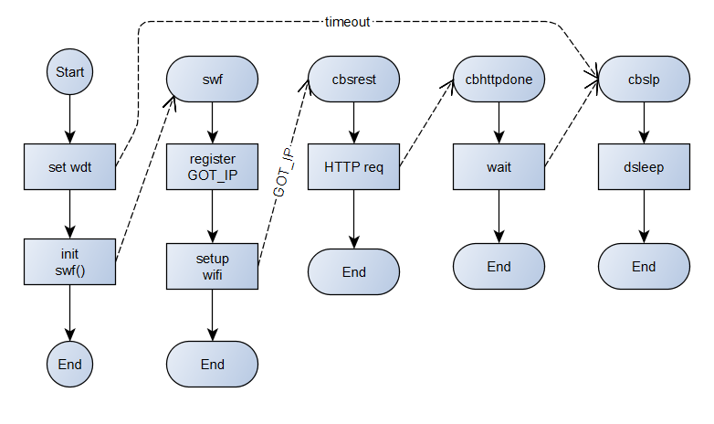

# A simple IoT temperature, humidity and pressure sensor for NodeMCU / Lua and submitting measurements by [RESTful API](https://en.wikipedia.org/wiki/Representational_state_transfer).

Above is a block diagram of the system.

To use the code, copy init.default.lua to init.lua, and nodevars.default.lua to nodevars.lua and customise the latter to suit your needs.

Enter your own APIKEY etc as appropriate.

The deep sleep function used depends on an external connection which you must make for it to work properly: connect a SB or germainium diode anode to RST, cathode to GPIO16 (D0).

See project described at https://owenduffy.net/blog/?p=13517.

Tested on:
NodeMCU 3.0.0.0 built on nodemcu-build.com provided by frightanic.com
	branch: release
	commit: d4ae3c364bd8ae3ded8b77d35745b7f07879f5f9
	release: 
	release DTS: 202105102018
	SSL: true
	build type: float
	LFS: 0x0 bytes total capacity
	modules: adc,bit,bme280_math,dht,encoder,file,gpio,http,i2c,mdns,mqtt,net,node,ow,sntp,spi,tmr,uart,wifi,tls
 build 2021-06-10 08:45 powered by Lua 5.1.4 on SDK 3.0.1-dev(fce080e)

